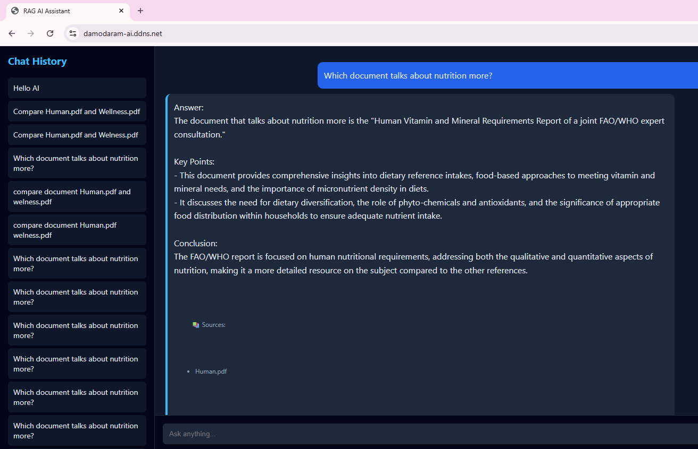
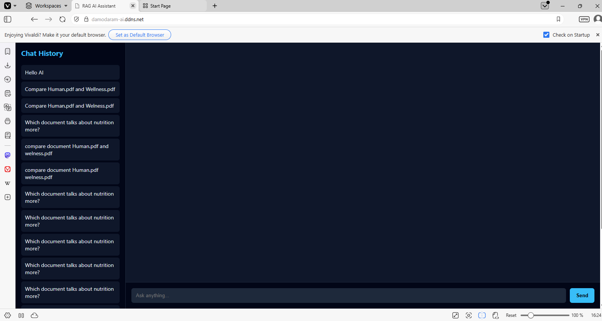
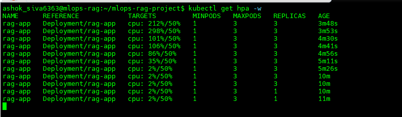
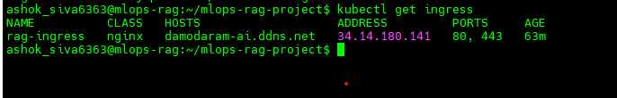

# 🚀 RAG MLOps Project (Production Deployment)

## 👨‍💻 Author
**Damodaram**  
GitHub: https://github.com/damodaramt/rag-mlops-project.git

---

## 📌 Overview
This project demonstrates a production-ready Retrieval-Augmented Generation (RAG) system deployed on Kubernetes (GKE).

The application allows users to query documents and receive intelligent answers using semantic search and Large Language Models (LLMs).

---

## ⚙️ Tech Stack
- FastAPI (Backend API)
- OpenAI API (LLM)
- PostgreSQL (Database)
- Vector Embeddings (Semantic Search)
- Docker (Containerization)
- Kubernetes (GKE)
- NGINX Ingress (Routing)
- Let's Encrypt (HTTPS)
- Horizontal Pod Autoscaler (HPA)

---

## 🌐 Live Demo
👉 http://damodaram-ai.ddns.net

---

## 🧠 Features
- Document-based Question Answering (RAG)
- Semantic search using embeddings
- Kubernetes-based deployment
- Domain routing using Ingress
- HTTPS-enabled secure access
- Auto-scaling using HPA
- Secure secret handling (no API keys exposed)

---

## 🏗️ Architecture

User → Domain → Ingress → Service → FastAPI → PostgreSQL → OpenAI

---

## 📸 Screenshots

### 🌐 Live Application

### 🧠 RAG UI

### ☸️ Kubernetes Pods

### 🌍 Ingress Mapping

### 📈 Autoscaling (HPA)

---

## 🚀 Deployment Workflow

1. Built FastAPI-based RAG application  
2. Containerized using Docker  
3. Deployed on Google Kubernetes Engine (GKE)  
4. Configured Service and Ingress  
5. Mapped domain using DNS  
6. Enabled HTTPS using cert-manager  
7. Implemented autoscaling using HPA  

---

## 🔐 Environment Variables

Create a `.env` file:

OPENAI_API_KEY=your_api_key  
DATABASE_URL=your_database_url  

⚠️ Do not commit `.env` file to GitHub

---

## 📂 Project Structure

